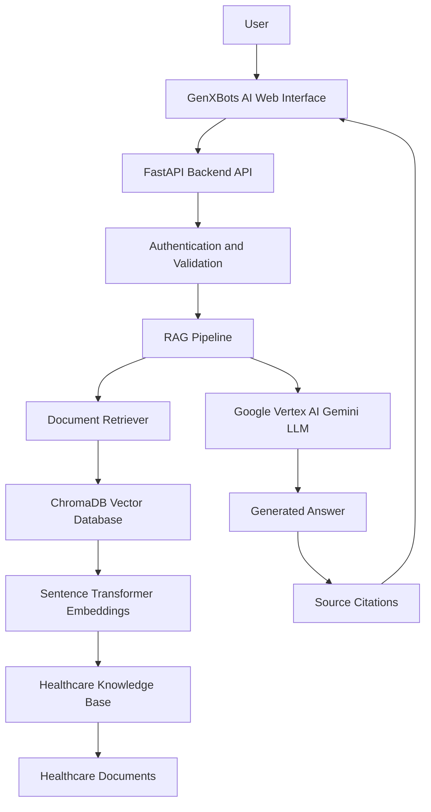

# GenXBots Healthcare AI Assistant

Enterprise Generative AI assistant using RAG architecture.

## Business Problem

Healthcare organizations manage thousands of documents...

## Solution

AI-powered knowledge assistant that allows users to ask questions...

## Architecture

## Technology Stack

- Vertex AI Gemini
- LangChain
- ChromaDB
- FastAPI
- Docker

## AI Workflow

Document → Embeddings → Vector Search → Gemini → Response

## Responsible AI

- HIPAA considerations
- Source citations
- Hallucination reduction

## Future Roadmap

- Enterprise authentication
- Multi-document support
- Analytics dashboard
