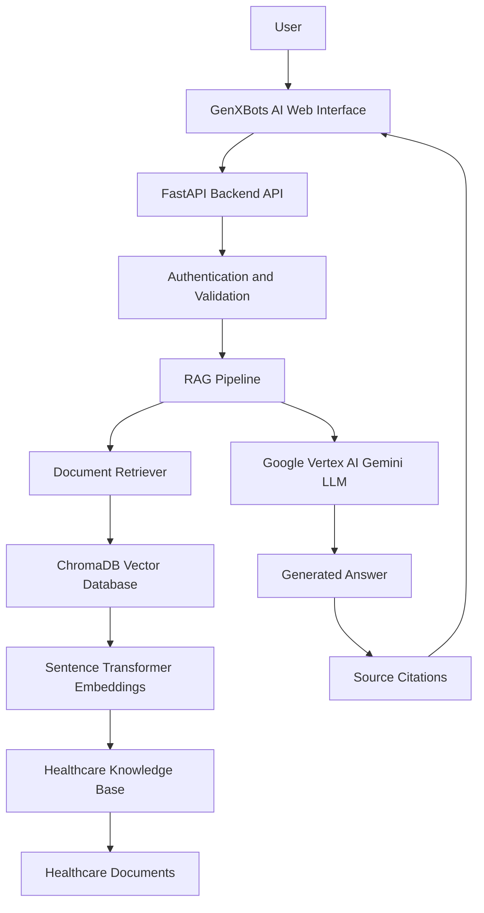
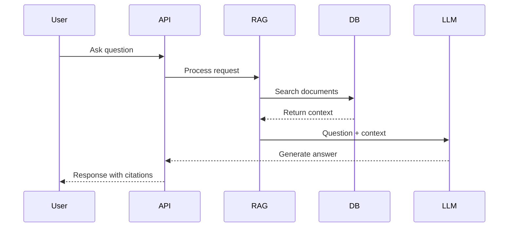

# GenXBots Healthcare AI Assistant

Enterprise Generative AI assistant using RAG architecture.

## Business Problem

Healthcare organizations manage thousands of documents...

## Solution

AI-powered knowledge assistant that allows users to ask questions...

## Architecture

GenXBots Healthcare AI Assistant uses:

Frontend: Web-based conversational AI interface

Backend: FastAPI REST API services

AI Framework: Retrieval-Augmented Generation (RAG)

LLM: Google Vertex AI Gemini

Embeddings: Sentence Transformers

Vector Store: ChromaDB

Knowledge Sources: Healthcare policies, clinical documents, and guidelines

Security: HIPAA-aligned controls, authentication, audit logging

Output: Context-grounded answers with document citations

## How It Works

1. User submits a healthcare-related question.
2. FastAPI receives and validates the request.
3. The RAG pipeline converts the query into embeddings.
4. ChromaDB retrieves relevant healthcare document chunks.
5. Vertex AI Gemini generates an answer using retrieved context.
6. The system returns an AI response with source references.

## Future Roadmap

- Enterprise authentication
- Multi-document support
- Analytics dashboard

## Technology Stack

| Layer | Technology |
|---|---|
| Frontend | Web UI / React |
| Backend | FastAPI |
| AI Framework | Retrieval-Augmented Generation (RAG) |
| LLM | Google Vertex AI Gemini |
| Embeddings | Sentence Transformers |
| Vector Database | ChromaDB |
| Cloud Platform | Google Cloud Platform |
| API Server | Uvicorn |
| Containerization | Docker |
| Security | HIPAA-aligned controls |

## AI Workflow

Document → Embeddings → Vector Search → Gemini → Response

## Healthcare AI Governance

The solution is designed with healthcare AI best practices:

- HIPAA-aware architecture
- Secure API access
- Document traceability
- Source citation generation
- Responsible AI response monitoring
- Human review capability
